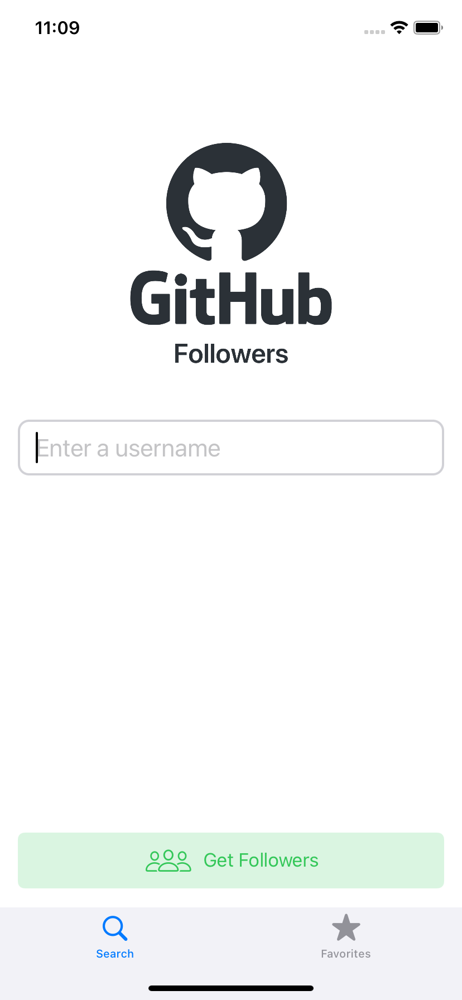
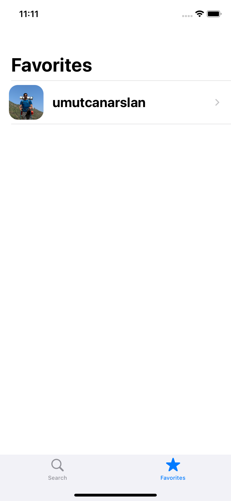
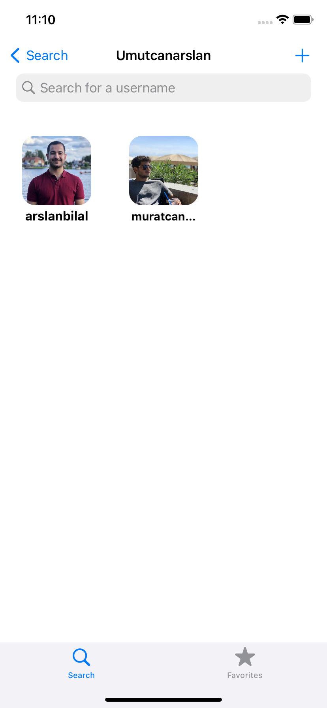
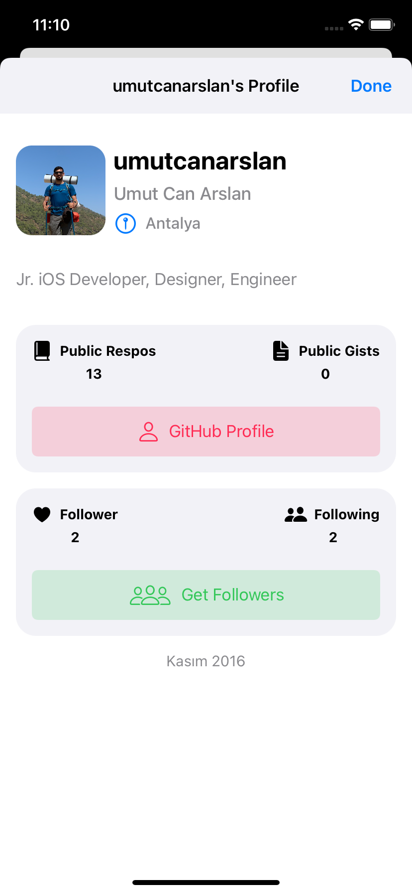

# Github Follower App

 
An application where you can see the followers of github users and add them to favorites.

- Sean Allen Github Followers App Course:
https://seanallen.teachable.com/p/take-home

### Screenshots:
&nbsp;
&nbsp;
&nbsp;
 

### Used Technologies:
- Collection View
- Table View
- Safari Service
- Async / Throws  

### Features:
- User's Follower
- User's Github Profile
- Favorite Users

### Requirements:
- Xcode 13+
- Swift 5+
- iOS 12+
